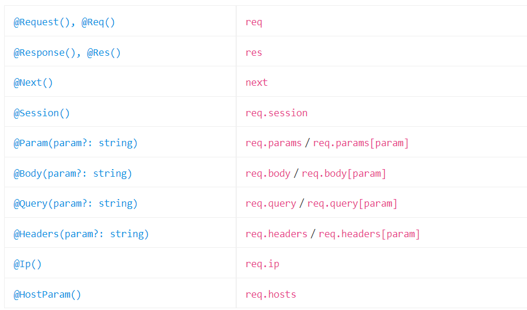

## Custom route decorators

Nest được xây dựng dựa trên một tính năng ngôn ngữ gọi là decorators. Decorator là một khái niệm nổi tiếng trong nhiều ngôn ngữ lập trình được sử dụng phổ biến, nhưng trong thế giới JavaScript, chúng vẫn còn tương đối mới. Đây là một định nghĩa đơn giản:

    Một decorator ES2016 là một biểu thức trả về một hàm và có thể lấy một bộ mô tả đích, tên và thuộc tính làm đối số. Bạn áp dụng nó bằng cách đặt tiền tố cho decorator bằng ký tự @ và đặt ký tự này ở trên cùng của những gì bạn đang cố gắng trang trí. Decorators có thể được định nghĩa cho một lớp, một phương thức hoặc một thuộc tính.

## Param decorators

Nest cung cấp một tập hợp param decorators hữu ích mà bạn có thể sử dụng cùng với các route hander HTTP. Dưới đây là danh sách các decorators được cung cấp và các đối tượng Express (hoặc Fastify) đơn giản mà chúng đại diện



Ngoài ra, bạn có thể tạo decorators tùy chỉnh của riêng mình. Tại sao điều này lại hữu ích?

Trong thế giới node.js, thông lệ là đính kèm các thuộc tính vào đối tượng request. Sau đó, bạn giải nén chúng theo cách thủ công trong route handler, sử dụng mã như sau:

```ts
const user = req.user;
```

Để làm cho mã của bạn dễ đọc và minh bạch hơn, bạn có thể tạo decorator @User() và sử dụng lại nó trên tất cả các controller của mình.

```ts
import { createParamDecorator, ExecutionContext } from "@nestjs/common";

export const User = createParamDecorator(
  (data: unknown, ctx: ExecutionContext) => {
    const request = ctx.switchToHttp().getRequest();
    return request.user;
  }
);
```

Sau đó, bạn có thể chỉ cần sử dụng nó ở bất cứ đâu phù hợp với yêu cầu của bạn.

```ts
@Get()
async findOne(@User() user: UserEntity) {
  console.log(user);
}
```

## Passing data

Khi hành vi của trình trang trí của bạn phụ thuộc vào một số điều kiện, bạn có thể sử dụng tham số data để truyền một đối số cho hàm gốc của decorator. Một trường hợp sử dụng cho điều này là decorator tùy chỉnh trích xuất các thuộc tính từ đối tượng yêu cầu bằng khóa. Ví dụ, giả sử rằng lớp xác thực authentication layer của chúng tôi xác thực các yêu cầu và gắn một thực thể người dùng vào đối tượng yêu cầu. Thực thể người dùng cho một yêu cầu đã xác thực có thể trông giống như sau:

```json
{
  "id": 101,
  "firstName": "Alan",
  "lastName": "Turing",
  "email": "alan@email.com",
  "roles": ["admin"]
}
```

Hãy xác định một decorator lấy tên thuộc tính làm khóa và trả về giá trị được liên kết nếu nó tồn tại (hoặc không xác định nếu nó không tồn tại hoặc nếu đối tượng user chưa được tạo).

```ts
import { createParamDecorator, ExecutionContext } from "@nestjs/common";

export const User = createParamDecorator(
  (data: string, ctx: ExecutionContext) => {
    const request = ctx.switchToHttp().getRequest();
    const user = request.user;

    return data ? user?.[data] : user;
  }
);
```

Đây là cách sau đó bạn có thể truy cập một thuộc tính cụ thể thông qua decorator @User() trong controller:

```ts
@Get()
async findOne(@User('firstName') firstName: string) {
  console.log(`Hello ${firstName}`);
}
```

Bạn có thể sử dụng cùng một decoratornày với các phím khác nhau để truy cập các thuộc tính khác nhau. Nếu đối tượng người dùng sâu hoặc phức tạp, điều này có thể giúp triển khai trình xử lý yêu cầu dễ dàng và dễ đọc hơn.

<ins>Chú ý</ins>: Đối với các người dùng TypeScript, chú ý rằng createParamDecorator<T>() is một cái chung. Điều này có nghĩa là bạn có thể thực thi an toàn kiểu một cách rõ ràng, ví dụ: createParamDecorator<string>((data, ctx) => ...). Ngoài ra, chỉ định một loại tham số trong hàm gốc, ví dụ: createParamDecorator((data: string, ctx) => ...).Nếu bạn bỏ qua cả hai, loại dữ liệu sẽ là bất kỳ.

## Working with pipes

Nest xử lý các decorators tham số tùy chỉnh theo cùng kiểu với các decorators tích hợp sẵn (@Body(), @Param() và @Query()). Điều này có nghĩa là các pipes cũng được thực thi cho các tham số được chú thích tùy chỉnh (trong ví dụ của chúng tôi là đối số người dùng). Hơn nữa, bạn có thể áp dụng pipe trực tiếp vào decorator tùy chỉnh:

```ts
@Get()
async findOne(
  @User(new ValidationPipe({ validateCustomDecorators: true }))
  user: UserEntity,
) {
  console.log(user);
}
```

<ins>Lưu ý</ins>: Tùy chọn validateCustomDecorators phải được đặt thành true. ValidationPipe không xác thực các đối số được chú thích bằng decorators tùy chỉnh theo mặc định.

## Decorator composition

Nest cung cấp một phương thức trợ giúp để tạo nhiều decorators. Ví dụ: giả sử bạn muốn kết hợp tất cả các decorators liên quan đến xác thực thành một decorator duy nhất. Điều này có thể được thực hiện với cấu trúc sau:

```ts
import { applyDecorators } from "@nestjs/common";

export function Auth(...roles: Role[]) {
  return applyDecorators(
    SetMetadata("roles", roles),
    UseGuards(AuthGuard, RolesGuard),
    ApiBearerAuth(),
    ApiUnauthorizedResponse({ description: "Unauthorized" })
  );
}
```

Sau đó, bạn có thể sử dụng decorator @Auth() tùy chỉnh này như sau:

```ts
@Get('users')
@Auth('admin')
findAllUsers() {}
```

Điều này có tác dụng áp dụng tất cả 4 decorators với một khai báo duy nhất.
