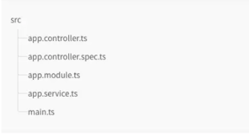

# NestJS

## 1. NestJS là gì?

- NestJS là một framework để xây dựng các ứng dụng Server-Side bằng Node.js hiệu quả, và để mở rộng.
- Sử dụng ngôi ngữ bậc cao của javascrip là TypeScript (nhưng vẫn cho phép các nhà phát triển sử dụng JavaScript thuần túy) và kết hợp các tính chất:
  - OOP (Lập trình hướng đối tượng): Là một kỹ thuật lập trình cho phép lập trình viên tạo ra các đối tượng trong code trừu tượng hóa các đối tượng.
  - FP (Lập trình chức năng): Một tiến trình tạo nên một phần mềm bằng cách kết hợp các pure function, và tránh chia sẻ states, mutable data, side-effect.
  - FRP (Lập trình phản ứng chức năng): Là một khuôn khổ chương trình kết hợp kỹ thuật lập trình chức năng và phản ứng để xây dựng các ứng dụng, dịch vụ và các thiết bị.
- Nest sử dụng được Express (mặc định) và tùy chọn để sử dụng Fastify !
- Nest cung cấp một tầng trừu tượng trên các framework Node.js phổ biến này (Express / Fastify), nhưng cũng hỗ trợ API của họ trực tiếp cho nhà phát triển.

## 2. Cấu trúc tổng quan NestJS?

- 
- app.controller.ts: Chứa các `router` để xử lý các `request` và trả về `reponse` cho client.
- app.controller.spec.ts: Có nhiệm vụ viết các `uni-test` cho các controller.
  - (Một Unit là một thành phần PM nhỏ nhất mà ta có thể kiểm tra được như các hàm `(Function)`, thủ tục `(Procedure)`, lớp `(Class)`, hoặc các phương thức `(Method)`.)
- app.module.ts: `Root module` của ứng dụng.
- app.service.ts: `Service` chứ các logic mà `controller` sẽ dùng đến.
- main.ts: Sử dụng `Factory` để khởi tạo ứng dụng

## 3. Các thành phần của NestJS

- **Controller**: Bộ điều khiển có trách nhiệm xử lý các yêu cầu đến và trả lại phản hồi cho khách hàng.

  - 
  - Syntax: `@Controller()` được yêu cầu để xác định một bộ điều khiển cơ bản.

    ```JS
    import { Controller, Get } from '@nestjs/common';

    @Controller('cats')
    export class CatsController {
    @Get()
    findAll(): string {
       return 'This action returns all cats';
    }
    }
    ```

  - Mục đích:
    - Nhận các yêu cầu cụ thể cho ứng dụng.
    - Cơ chế định tuyến (`routing`) kiểm soát bộ điều khiển nào nhận được yêu cầu nào.
    - Thông thường, mỗi bộ điều khiển có nhiều hơn một tuyến và các tuyến khác nhau có thể thực hiện các hành động khác nhau.
    - Sử dụng trang trí nội dung (`decorators`)
  - `Routing`:

    - Sử dụng cơ chế kiểm soát bộ điều khiển nào nhận được yêu cầu nào
    - Syntax: @Controller(‘`/customers`’)
      - `/customers`: Tuyến đường chỉ định
    - NestJS có 2 tùy chọn phản hồi khác nhau
      - | Content                  | Description                                                                                                                 |     |
        | ------------------------ | --------------------------------------------------------------------------------------------------------------------------- | --- |
        | Tiêu chuẩn (khuyến nghị) | - Sử dụng khi một trình xử lý yêu cầu trả về một đối tượng hoặc mảng JavaScript, nó sẽ tự động được tuần tự hóa thành JSON. |
        |                          | - Khi nó trả về một loại Javascript nguyên thủy Nest sẽ gửi chỉ là giá trị mà không cần cố gắng để serialize nó.            |     |
        |                          | - Có thể dễ dàng thay đổi hành vi này bằng cách thêm trình `@HttpCode(...)` trang trí ở cấp trình xử lý                     |
        | Thư viện cụ thể          | Sử dụng đối tượng phản hồi dành riêng cho thư viện                                                                          |
        |                          | Đối tượng này có thể được đưa vào bằng cách sử dụng trình `@Res()` trang trí trong chữ ký của trình xử lý phương thức       |
        |                          | Ex: `findAll(@Res() response)`                                                                                              |
    - `Request object`:
      - Nest truy cập đối tượng bằng `@Req()`
      - Nội dung sử dụng `@Body()` hoặc `@Query()`
      - `Res()` Trực tiếp hiển thị `response` giao diện đối tượng nền tảng gốc bên dưới.
    - `Resources`:
      - Nest cung cấp trang trí cho tất cả các phương thức HTTP tiêu chuẩn:
        - `@Get(), @Post(), @Put(), @Delete(), @Patch(), @Options()`, và `@Head()`. Ngoài ra, `@All()` xác định một điểm cuối xử lý tất cả chúng.
    - `Status code`:
      ```JS
            @Post()
      @HttpCode(204)
      create() {
      return 'Hành động này thêm một con mèo mới';
      }
      ```
      | Code | Status           | Description                                                                                                                                                             |
      | ---- | ---------------- | ----------------------------------------------------------------------------------------------------------------------------------------------------------------------- |
      | 1xx  | ...              | ...                                                                                                                                                                     |
      | ...  | ...              | ...                                                                                                                                                                     |
      | 200  | OK               | Nếu nhấp vào một liên kết không có URL mục tiêu, phản hồi này được máy chủ suy ra và không cảnh báo người dùng về bất cứ điều gì.                                       |
      | 204  | No Content       | Nếu nhấp vào một liên kết không có URL mục tiêu, phản hồi này được máy chủ suy ra và không cảnh báo người dùng về bất cứ điều gì.                                       |
      | 404  | Not Found        | Các file được yêu cầu không có trên máy chủ. Có thể bởi vì những file này đã bị xóa, hoặc chưa từng tồn tại trước đây. Nguyên nhân thường là do lỗi chính tả trong URL. |
      | 408  | Request Time-out | Máy chủ mất quá nhiều thời gian để xử lý yêu cầu. Lỗi này thường gây ra bởi lưu lượng truy cập mạng cao.                                                                |
      | 5xx  | ...              | ...                                                                                                                                                                     |
    - `Header`: Để chỉ định tiêu đề phản hồi tùy chỉnh, bạn có thể sử dụng trình `@Header()` trang trí hoặc đối tượng phản hồi dành riêng cho thư viện (và gọi `res.header()` trực tiếp)
      ```JS
          @Post()
          @Header('Cache-Control', 'none')
          create() {
          return 'This action adds a new cat';
          }
      ```
    - `@Redirect()` nhận hai đối số `url` và `statusCode`, cả hai đều là tùy chọn. Giá trị mặc định của `statusCode` là `302( Found)` nếu bị bỏ qua.
      ```JS
          @Get()
          @Redirect('https://nestjs.com', 301)
      ```
    - `Route parameters`:
      - Các tuyến có đường dẫn tĩnh sẽ không hoạt động khi bạn cần phải chấp nhận dữ liệu động như một phần của yêu cầu
        ```JS
          @Get(':id')
          findOne(@Param() params): string {
          console.log(params.id);
          return `This action returns a #${params.id} cat`;
        }
        ```
        - Trong đó:
          - Mã thông số tuyến đường trong `@Get()`
          - `@Param()` được sử dụng để trang trí một tham số phương thức
    - `Sub-Domain Routing`

      ```js
      @Controller({ host: ':account.example.com' })
      export class AccountController {
        @Get()
        getInfo(@HostParam('account') account: string) {
          return account;
        }
      }
      ```

      - `hosts`: Tương tự như một tuyến đường `path`:
        - Sử dụng trình `@HostParam()` trang trí.
        - CẢNH BÁO
          ```css
            Vì Fastify thiếu hỗ trợ cho các bộ định tuyến lồng nhau, khi sử dụng
            định tuyến miền phụ, bộ điều hợp Express (mặc định) nên được sử dụng
            thay thế.
          ```

    - `Scopes`

      - Trong Nest hầu hết mọi thứ đều được chia sẻ qua các yêu cầu gửi đến.
      - Kết nối đến cơ sở dữ liệu, các dịch vụ `singleton` với trạng thái toàn cục, v.v.
      - Node.js không tuân theo Mô hình không trạng thái đa luồng yêu cầu / phản hồi
        - Trong đó: Mọi yêu cầu được xử lý bởi một luồng riêng biệt nên việc sử dụng singleton là an toàn.
      - Có những trường hợp cạnh khi thời gian tồn tại dựa trên yêu cầu của bộ điều khiển có thể là hành vi mong muốn.

        - Ex: Bộ nhớ đệm theo yêu cầu trong các ứng dụng GraphQL, theo dõi yêu cầu hoặc cho thuê nhiều lần. Phạm vi tiêm cung cấp một cơ chế để có được hành vi lâu dài của trình cung cấp mong muốn
        - **Injection scopes**

          - `Provider scope`: Một nhà cung cấp có thể có bất kỳ phạm vi nào sau đây:
            - | Content   | Description                                                                                                                                                                                                                                                                                 |
              | --------- | ------------------------------------------------------------------------------------------------------------------------------------------------------------------------------------------------------------------------------------------------------------------------------------------- |
              | DEFAULT   | Một phiên bản duy nhất của nhà cung cấp được chia sẻ trên toàn bộ ứng dụng. Thời gian tồn tại của phiên bản được gắn trực tiếp với vòng đời của ứng dụng. Khi ứng dụng đã được khởi động, tất cả các nhà cung cấp singleton đã được khởi tạo. Phạm vi Singleton được sử dụng theo mặc định. |
              | REQUEST   | Một phiên bản mới của nhà cung cấp được tạo riêng cho mỗi yêu cầu đến . Ví dụ được thu thập rác sau khi yêu cầu hoàn tất quá trình xử lý.                                                                                                                                                   |
              | TRANSIENT | Các nhà cung cấp tạm thời không được chia sẻ cho người tiêu dùng. Mỗi người tiêu dùng đưa vào một nhà cung cấp tạm thời sẽ nhận được một phiên bản mới, chuyên dụng.                                                                                                                        |
          - `Usage`

            - Chỉ định phạm vi tiêm bằng cách chuyển thuộc `scope` tính cho `@Injectable()` đối tượng tùy chọn trang trí

              ```js
              import { Injectable, Scope } from '@nestjs/common';

              @Injectable({ scope: Scope.REQUEST })
              export class CatsService {}
              ```

            - LƯU Ý:
              ```css
                Các cổng không nên sử dụng các nhà cung cấp có phạm vi yêu cầu vì họ phải hoạt động như các cổng đơn. Mỗi cổng bao bọc một ổ cắm thực và không thể được khởi tạo nhiều lần.
              ```

          - `Controller scope`

            - Bộ điều khiển cũng có thể có phạm vi, áp dụng cho tất cả các trình xử lý phương thức yêu cầu được khai báo trong bộ điều khiển đó.
            - Đối với bộ điều khiển phạm vi yêu cầu, một phiên bản mới được tạo cho mỗi yêu cầu gửi đến và được thu thập rác khi yêu cầu đã hoàn tất xử lý.

            - Khai báo phạm vi bộ điều khiển với `scope` thuộc tính của `ControllerOptions` đối tượng:
              ```js
              @Controller({
                path: 'cats',
                scope: Scope.REQUEST,
              })
              export class CatsController {}
              ```

          - `Scope hierarchy`
            - Một bộ điều khiển phụ thuộc vào nhà cung cấp phạm vi yêu cầu, bản thân nó, sẽ được xác định phạm vi yêu cầu.
            - Ex: Đồ thị phụ thuộc sau: `CatsController <- CatsService <- CatsRepository`.
              - Nếu `CatsService` là phạm vi yêu cầu (và những người khác là các đơn lẻ mặc định)
                -> `CatsController` sẽ trở thành phạm vi yêu cầu vì nó phụ thuộc vào dịch vụ được đưa vào. -> Các `CatsRepository`, mà không phải là phụ thuộc, sẽ vẫn `singleton-scoped`.
          - `Request provide`

            - Để truy cập một tham chiếu đến đối tượng yêu cầu ban đầu khi sử dụng các nhà cung cấp phạm vi yêu cầu thì ta cần tiêm `REQUEST` đối tượng.
            - Ex: Trong một ứng dụng dựa trên máy chủ HTTP (sử dụng `@nestjs/platform-express` hoặc `@nestjs/platform-fastify`),
            - Syntax:

              ```js
                import { Injectable, Scope, Inject } from '@nestjs/common';
                import { REQUEST } from '@nestjs/core';
                import { Request } from 'express';

                @Injectable({ scope: Scope.REQUEST })
                export class CatsService {
                  constructor(@Inject(REQUEST) private request: Request) {}
                }
              ```

          - Đối với ứng dụng `Microservice` hoặc `GraphQL`.

            - Trong các ứng dụng GraphQL: chèn `CONTEXT` thay `REQUEST`:

              ```JS
              import { Injectable, Scope, Inject } from '@nestjs/common';
              import { CONTEXT } from '@nestjs/graphql';

              @Injectable({ scope: Scope.REQUEST })
              export class CatsService {
                constructor(@Inject(CONTEXT) private context) {}
              }
              ```

              -> Sau đó, cấu hình `context` giá trị (trong GraphQLModule) để chứa `request` làm thuộc tính của nó.

    - `Asynchronicity`
      - NestJS sử dụng `TypeScript` ( ngôn ngữ bậc cao `JavaScript` ) nên việc trích xuất dữ liệu chủ yếu là không đồng bộ.
      - Mọi hàm không đồng bộ phải trả về `Promise` (Có nghĩa là có thể trả về một giá trị hoãn lại mà Nest sẽ có thể tự giải quyết)
        - Ex:
          ```js
            @Get()
            async findAll(): Promise<any[]> {
            return [];
            }
          ```
      - Các trình xử lý tuyến Nest thậm chí còn mạnh hơn khi có thể trả về các luồng có thể quan sát được `RxJS`
        - `RxJS` (Reactive Extensions): 1 thư viện rất tiện lợi cho việc xư lý bất đồng bộ (bao gồm cả việc xư lý dựa trên sự kiện như 1 cú click chuột.
        - Nest sẽ tự động đăng ký nguồn bên dưới và lấy giá trị phát ra cuối cùng
          ```js
            @Get()
            findAll(): Observable<any[]> {
              return of([]);
            }
          ```
    - `Request payloads`
      - Trình xử lý định tuyến `POST` không chấp nhận bất kỳ thông số ứng dụng nào
        - Sử dụng trình `@Body()` để giải quyết.
      - Xác định lược đồ đồ `DTO`
        - `DTO` là một đối tượng xác định cách dữ liệu sẽ được gửi qua mạng
        - Tạo lớp `CreateCatDto`
          ```js
          export class CreateCatDto {
            name: string;
            age: number;
            breed: string;
          }
          ```
        - Sử dụng DTO mới được tạo bên trong `CatsController`
          ```js
            @Post()
            async create(@Body() createCatDto: CreateCatDto) {
              return 'This action adds a new cat';
            }
          ```
        - Sử dụng `ValidationPipe` để lọc ra các thuộc tính không được nhận bởi trình xử lý phương thức.
          - `Auto-validation`
            - Ràng buộc `ValidationPipe` ở cấp ứng dụng, để đảm bảo tất cả các điểm cuối được bảo vệ khỏi việc nhận dữ liệu không chính xác.
              ```js
              async function bootstrap() {
                const app = await NestFactory.create(AppModule);
                app.useGlobalPipes(new ValidationPipe());
                await app.listen(3000);
              }
              bootstrap();
              ```
    - `Handling errors`
    - `Full resource sample`

      - Ex:

        ```js
        import {
          Controller,
          Get,
          Query,
          Post,
          Body,
          Put,
          Param,
          Delete,
        } from '@nestjs/common';
        import { CreateCatDto, UpdateCatDto, ListAllEntities } from './dto';

        @Controller('cats')
        export class CatsController {
          @Post()
          create(@Body() createCatDto: CreateCatDto) {
            return 'This action adds a new cat';
          }

          @Get()
          findAll(@Query() query: ListAllEntities) {
            return `This action returns all cats (limit: ${query.limit} items)`;
          }

          @Get(':id')
          findOne(@Param('id') id: string) {
            return `This action returns a #${id} cat`;
          }

          @Put(':id')
          update(@Param('id') id: string, @Body() updateCatDto: UpdateCatDto) {
            return `This action updates a #${id} cat`;
          }

          @Delete(':id')
          remove(@Param('id') id: string) {
            return `This action removes a #${id} cat`;
          }
        }
        ```

    - `Library-specific approach`

      - Cách trên là cách thao tác phản hồi tiêu chuẩn của Nest.
      - Cách thứ hai để điều khiển phản hồi là sử dụng đối tượng phản hồi dành riêng cho thư viện.

        - Ex: Sử dụng `@Res()` để đưa vào một đối tượng phản hồi.

          ```js
          import {
            Controller,
            Get,
            Post,
            Res,
            HttpStatus,
          } from '@nestjs/common';
          import { Response } from 'express';

          @Controller('cats')
          export class CatsController {
            @Post()
            create(@Res() res: Response) {
              res.status(HttpStatus.CREATED).send();
            }

            @Get()
            findAll(@Res() res: Response) {
              res.status(HttpStatus.OK).json([]);
            }
          }
          ```

- **Providers**

  - Nhiều lớp Nest cơ bản có thể được coi như một nhà cung cấp - dịch vụ, kho lưu trữ, nhà máy, người trợ giúp, v.v.
    - Các đối tượng có thể tạo ra nhiều mối quan hệ khác nhau với nhau và chức năng "nối dây" các cá thể của đối tượng phần lớn có thể được ủy quyền cho hệ thống thời gian chạy Nest.
    - Cấu trúc
    - 
  - `Service`: Nhiệm vụ lưu trữ và truy xuất dữ liệu, và được thiết kế để sử dụng bởi `CatsController`

    - Ex:

      ```js
        import { Injectable } from '@nestjs/common';
        import { Cat } from './interfaces/cat.interface';

        @Injectable()
        export class CatsService {
          private readonly cats: Cat[] = [];

          create(cat: Cat) {
            this.cats.push(cat);
          }

          findAll(): Cat[] {
            return this.cats;
          }
        }
      ```

- **Dependency injection (DI)** && **Inversion of Control (IoC)**

  - Tổng quan:
  - 

    - `Dependency Inversion`: Đây là một nguyên lý để thiết kế và viết code (Nguyên lý cuối cùng trong `SOLID`).
      - 1. Các module cấp cao không nên phụ thuộc vào các modules cấp thấp. Cả 2 nên phụ thuộc vào abstraction.
      - 2. Interface (abstraction) không nên phụ thuộc vào chi tiết, mà ngược lại. ( Các class giao tiếp với nhau thông qua interface, không phải thông qua implementation.)
    - `Inversion of Control`: Là một `design pattern` được tạo ra để code có thể tuân thủ nguyên lý `Dependency Inversion`.

      - Có nhiều cách hiện thực `pattern` này: `ServiceLocator`, `Event`, `Delegate`, … `Dependency Injection` là một trong các cách đó.

        - `Dependency Injection`: Đây là một cách để hiện thực `IOC` .

          - Các module phụ thuộc (dependency) sẽ được inject vào module cấp cao.
          - Một số DI container: `Unity`, `StructureMap` v…v, (hỗ trợ việc cài đặt và áp dụng DI vào code)
          - > Có thể hiểu `DI` một cách đơn giản như sau:
            - 1.
              - Các module không giao tiếp trực tiếp với nhau, mà thông qua `interface`.
              - Module cấp thấp sẽ `implement interface`, module cấp cao sẽ gọi module cấp thấp thông qua interface.
                - Ex: Để giao tiếp với `database`, ta có `interface IDatabase`, các module cấp thấp là `XMLDatabase`, `SQLDatabase`. Module cấp cao là `CustomerBusiness` sẽ chỉ sử dụng `interface IDatabase`.
            - 2. Việc khởi tạo các module cấp thấp sẽ do DI Container thực hiện.
              - Ex: Trong `module CustomerBusiness`, ta sẽ không khởi tạo `IDatabase db = new XMLDatabase()`, việc này sẽ do `DI` Container thực hiện. `Module CustomerBusiness` sẽ không biết gì về `module XMLDatabase` hay `SQLDatabase`.
            - 3. Việc Module nào gắn với interface nào sẽ được config trong code hoặc trong file XML.
            - 4. DI được dùng để làm giảm sự phụ thuộc giữa các module, dễ dàng hơn trong việc thay đổi module, bảo trì code và testing.
          - Các dạng DI: Có 3 dạng `Dependency Injection`

            - 1. `Constructor Injection`:
              - Các `dependency` sẽ được container truyền vào (inject vào) 1 class thông qua `constructor` của class đó. Đây là cách thông dụng nhất.
            - 2. `Setter Injection`:
              - Các dependency sẽ được truyền vào 1 class thông qua các hàm Setter.
            - 3. `Interface Injection`:
              - Class cần inject sẽ implement 1 interface.
              - Interface này chứa 1 hàm tên Inject.
              - Container sẽ injection dependency vào 1 class thông qua việc gọi hàm Inject của interface đó. Đây là cách rườm rà và ít được sử dụng nhất.

          - Ưu điểm và khuyết điểm của DI
            - | Ưu điểm                                                                                 | Khuyết điểm                                                                             |
              | --------------------------------------------------------------------------------------- | --------------------------------------------------------------------------------------- |
              | Giảm sự kết dính giữa các module                                                        | Khái niệm DI khá “khó tiêu”, các developer mới sẽ gặp khó khăn khi học                  |
              | Code dễ bảo trì, dễ thay thế module                                                     | Sử dụng interface nên đôi khi sẽ khó debug, do không biết chính xác module nào được gọi |
              | Rất dễ test và viết `Unit Test`                                                         | Các object được khởi tạo toàn bộ ngay từ đầu, có thể làm giảm performance               |
              | Dễ dàng thấy quan hệ giữa các module (Vì các dependecy đều được inject vào constructor) | Làm tăng độ phức tạp của code                                                           |
          - `Dependency` : Là những module cấp thấp, hoặc cái service gọi từ bên ngoài.

            - Các module cấp cao sẽ gọi các module cấp thấp.
            - Module cấp cao sẽ phụ thuộc và module cấp thấp -> dependency.
            - 
            - Ex: Hàm Checkout của class `Cart`: sẽ khởi tạo và gọi module Database, module EmailSender, module Logger, các module này chính là các dependency.

              ````js
              public class Cart
              {
              public void Checkout(int orderId, int userId)
              {
              Database db = new Database();
              db.Save(orderId);
                              Logger log = new Logger();
                              log.LogInfo("Order has been checkout");

                              EmailSender es = new EmailSender();
                              es.SendEmail(userId);
                          }
                      }
                  ```
                    - Rất khó test
                    - Muốn thay đổi phải sửa toàn bộ các chỗ khởi tạo và gọi các module này. Việc làm này rất mất thời gian, dễ gây lỗi.
                    - Sau này về lâu dài, code sẽ trở nên “kết dính.
              > Inversion of Control và Dependency Injection đã ra đời để giải quyết những vấn đề này.
              ````

            - Xử lí
            - Ex:

              ```js
                  // Interface
                public interface IDatabase
                {
                    void Save(int orderId);
                }

                public interface ILogger
                {
                    void LogInfo(string info);
                }

                public interface IEmailSender
                {
                    void SendEmail(int userId);
                }

                // Các Module implement các Interface
                public class Logger : ILogger
                {
                    public void LogInfo(string info)
                    {
                        //...
                    }
                }

                public class Database : IDatabase
                {
                    public void Save(int orderId)
                    {
                        //...
                    }
                }

                public class EmailSender : IEmailSender
                {
                    public void SendEmail(int userId)
                    {
                        //...
                    }
                }
              ```

              - Mục đích ta có thể dễ dàng thay đổi, swap các module cấp thấp mà không ảnh hưởng tới module Cart
              - Hàm checkout mới:

                ```js
                    public void Checkout(int orderId, int userId)
                      {
                    // Nếu muốn thay đổi database, ta chỉ cần thay dòng code dưới
                    // Các Module XMLDatabase, SQLDatabase phải implement IDatabase
                    //IDatabase db = new XMLDatabase();
                    //IDatebase db = new SQLDatabase();
                    IDatabase db = new Database();
                    db.Save(orderId);

                    ILogger log = new Logger();
                    log.LogInfo("Order has been checkout");

                    IEmailSender es = new EmailSender();
                    es.SendEmail(userId);
                    }
                ```

                - Để dễ quản lý, ta có thể bỏ tất cả những hàm khởi tạo module vào constructor của class Cart.

                  ```js
                      public class Cart
                        {
                            private readonly IDatabase _db;
                            private readonly ILogger _log;
                            private readonly IEmailSender _es;

                            public Cart()
                            {
                                _db = new Database();
                                _log = new Logger();
                                _es = new EmailSender();
                            }

                            public void Checkout(int orderId, int userId)
                            {
                                _db.Save(orderId);
                                _log.LogInfo("Order has been checkout");
                                _es.SendEmail(userId);
                            }
                        }
                  ```

                - Nếu có nhiều module khác cần dùng tới Logger, Database thì ta dụng `Dependency Injection`

                  - Các Module cấp thấp sẽ được inject (truyền vào) vào Module cấp cao thông qua `Constructor` hoặc thông qua `Properties`
                  - Ex:

                    ```js
                      public Cart(IDatabase db, ILogger log, IEmailSender es)
                        {
                                _db = db;
                                _log = log;
                                _es = es;
                        }

                        //Dependency Injection một cách đơn giản nhất
                        Cart myCart = new Cart(new Database(),
                                          new Logger(), new EmailSender());
                        //Khi cần thay đổi database, logger
                        myCart = new Cart(new XMLDatabase(),
                                      new FakeLogger(), new FakeEmailSender());

                    ```

    - `Scopes`:
      - Các nhà cung cấp thường có vòng đời (`"scope"`) được đồng bộ hóa với vòng đời ứng dụng.
      - Khi ứng dụng được khởi động, mọi phụ thuộc phải được giải quyết và do đó mọi trình cung cấp phải được khởi tạo.
    - **Custom providers**

      - Ex: Tiêm phụ thuộc dựa trên `phương thức khởi tạo` (DI) được sử dụng để đưa các cá thể (nhà cung cấp) vào các lớp.
      - B1: Xác định một nhà cung cấp.

        - Sử dụng `@Injectable()` đánh dấu `CatsService` lớp là một trình cung cấp.
        - Ex: `cat.service.ts`

          ```js
          import { Injectable } from '@nestjs/common';
          import { Cat } from './interfaces/cat.interface';

          @Injectable()
          export class CatsService {
            private readonly cats: Cat[] = [];

            findAll(): Cat[] {
              return this.cats;
            }
          }
          ```

      - B2: Yêu cầu Nest đưa nhà cung cấp vào lớp bộ điều khiển

        - Ex: `cat.controller.ts`

          ```js
          import { Controller, Get } from '@nestjs/common';
          import { CatsService } from './cats.service';
          import { Cat } from './interfaces/cat.interface';

          @Controller('cats')
          export class CatsController {
            constructor(private catsService: CatsService) {}

            @Get()
            async findAll(): Promise<Cat[]> {
              return this.catsService.findAll();
            }
          }
          ```

      - B3: Đăng ký nhà cung cấp với vùng chứa `Nest IoC`:

        - Ex: `app.module.ts`

          ```js
          import { Module } from '@nestjs/common';
          import { CatsController } from './cats/cats.controller';
          import { CatsService } from './cats/cats.service';

          @Module({
            controllers: [CatsController],
            providers: [CatsService],
          })
          export class AppModule {}
          ```

      - Ba bước chính trong quy trình:

        - 1. Trong cats.service.ts, trình `@Injectable()` trang trí khai báo `CatsServicelớp` là một lớp có thể được quản lý bởi vùng chứa Nest IoC.
        - 2. Trong `cats.controller.ts`, `CatsController` khai báo một sự phụ thuộc vào `CatsService` mã thông báo với chèn hàm tạo:
             > constructor(`private catsService: CatsService`)
          - Constructor Injection: Các dependency sẽ được container truyền vào (inject) 1 class thông qua constructor của class đó. Đây là cách thông dụng nhất.
        - 3. Trong app.module.ts, liên kết mã thông báo `CatsService` với lớp `CatsService` từ `cats.service.ts` tệp.

      - `Standard providers` (Các nhà cung cấp tiêu chuẩn)

        - Syntax:
          ```js
            @Module({
            controllers: [CatsController],
            providers: [CatsService],
            })
          ```
        - Cung cấp các nhà cung cấp đó thông qua danh sách các tên lớp.
          - Syntax `providers: [CatsService]` là viết tắt của cú pháp đầy đủ hơn:
          ```js
          providers: [
            {
              provide: CatsService,
              useClass: CatsService,
            },
          ];
          ```

      - `Custom providers` (Nhà cung cấp tùy chỉnh): Nest cho phép xác định các nhà cung cấp Tùy chỉnh để xử lý các trường hợp sau:

        - Tạo một phiên bản tùy chỉnh thay vì có Nest khởi tạo (hoặc trả về một phiên bản được lưu trong bộ nhớ cache của) một lớp
        - Sử dụng lại một lớp hiện có trong phụ thuộc thứ hai
        - Ghi đè một lớp bằng phiên bản giả để thử nghiệm

      - `Value providers (Các nhà cung cấp giá trị): useValue`

        - Syntax `useValue`:
          - Tiêm một giá trị không đổi.
          - Đặt một thư viện bên ngoài vào container Nest.
          - Thay thế một việc thực hiện thực tế với một đối tượng giả.
        - Ex: Buộc Nest sử dụng mô hình `CatsService` cho mục đích thử nghiệm.

        ```js
        import { CatsService } from './cats.service'; // Mã thông báo này sẽ phân giải thành mockCatsService đối tượng giả

        const mockCatsService = {
          /* thực hiện mô hình
        ...
        */
        };

        @Module({
          imports: [CatsModule],
          providers: [
            {
              provide: CatsService,
              useValue: mockCatsService, // yêu cầu một giá trị - trong trường hợp này là một đối tượng theo nghĩa đen có cùng giao diện với CatsService lớp mà nó đang thay thế
            },
          ],
        })
        export class AppModule {}
        ```

      - `Non-class-based provider tokens` (Mã thông báo của nhà cung cấp không dựa trên lớp học)

        - Sử dụng tên lớp làm mã thông báo nhà cung cấp. (phương thức `tiêm dựa trên phương thức khởi tạo`)
        - Ex: Về sự linh hoạt khi sử dụng chuỗi hoặc ký hiệu làm mã thông báo DI

          ```js
          import { connection } from './connection';

          @Module({
            providers: [
              {
                provide: 'CONNECTION',
                useValue: connection,
              },
            ],
          })
          // Liên kết( 'CONNECTION') với một connection đối tượng đã có từ bên ngoài.
          export class AppModule {}
          ```

        - LƯU Ý: Ngoài việc sử dụng chuỗi làm giá trị mã thông báo, có thể sử dụng các ký hiệu `JavaScript` hoặc `enums TypeScript` .
          - `enume` là kiểu dữ liệu của `TypeScript`
          - Tập hợp các giá trị cùng nhóm
          - Dễ dàng quản lí và truy xuất
          - Sử dụng cho data 1 chiều.
            ```js
              enum Staus {
                PENDING,    //0
                IN_PROGRESS //1
                DONE        //2
              }
            ```
        - Sử dụng trình `@Inject()` để tiêm một nhà `'CONNECTION'` cung cấp tùy chỉnh sử dụng mã thông báo có giá trị chuỗi,
          ```js
          @Injectable()
          export class CatsRepository {
            constructor(@Inject('CONNECTION') connection: Connection) {}
          }
          ```
        - Chú ý: Để tổ chức mã sạch, cách tốt nhất là xác định mã thông báo trong một tệp riêng biệt

      - `Class providers: useClass`

        - `useClass`: cho phép tự động xác định một lớp mà một mã thông báo sẽ giải quyết cho.
        - Ex: Giả sử có một lớp trừu tượng `ConfigService`. Tùy thuộc vào môi trường hiện tại muốn Nest cung cấp cách triển khai dịch vụ cấu hình khác nhau.

          ```js
          const configServiceProvider = {
            provide: ConfigService, // Lớp làm mã thông báo
            useClass:
              process.env.NODE_ENV === 'development'
                ? DevelopmentConfigService
                : ProductionConfigService,
          };

          @Module({
            providers: [configServiceProvider], // Xác định configServiceProvider đối tượng sau đó chuyển nó vào thuộc tính của trình trang trí module providers.
          })
          export class AppModule {}
          ```

      - `Factory providers: useFactory` -`useFactory` tạo ra các nhà cung cấp tự động

        - Nhà cung cấp thực tế sẽ được cung cấp bởi giá trị trả về từ một chức năng của nhà máy.
        - Chức năng của nhà máy có thể đơn giản hoặc phức tạp nếu cần.
        - Cú pháp của nhà cung cấp gốc có một cặp cơ chế liên quan:

          - 1. Hàm nhà máy có thể chấp nhận các đối số (options).
          - 2. Thuộc tính (options) `inject` chấp nhận một mảng các trình cung cấp mà Nest sẽ phân giải và chuyển làm đối số cho hàm gốc trong quá trình khởi tạo.
          - Ex:

            ```js
            const connectionFactory = {
              provide: 'CONNECTION',
              useFactory: (optionsProvider: OptionsProvider) => {
                const options = optionsProvider.get();
                return new DatabaseConnection(options);
              },
              inject: [OptionsProvider],
            };

            @Module({
              providers: [connectionFactory],
            })
            export class AppModule {}
            ```

      - `Alias providers: useExisting` (Nhà cung cấp bí danh)

        - `useExisting` cho phép tạo các biệt hiệu cho các nhà cung cấp hiện có.
        - Điều này tạo ra hai cách để truy cập cùng một nhà cung cấp.
        - Ex:

          ```js
          @Injectable()
          class LoggerService {
            /* chi tiết thực hiện */
          }

          const loggerAliasProvider = {
            provide: 'AliasedLoggerService', // Bí danh cho mã thông báo (dựa trên lớp) LoggerService
            useExisting: LoggerService,
          };

          @Module({
            providers: [LoggerService, loggerAliasProvider],
          })
          export class AppModule {}
          ```

      - `Non -service based providers` (Các nhà cung cấp không dựa trên dịch vụ )

        - Một nhà cung cấp có thể cung cấp bất kỳ giá trị nào.
        - Ex: Một nhà cung cấp có thể cung cấp một loạt các đối tượng cấu hình dựa trên môi trường hiện tại.

          ```js
          const configFactory = {
            provide: 'CONFIG',
            useFactory: () => {
              return process.env.NODE_ENV === 'development'
                ? devConfig
                : prodConfig;
            },
          };

          @Module({
            providers: [configFactory],
          })
          export class AppModule {}
          ```

      - `Export custom provider` (Xuất nhà cung cấp tùy chỉnh)

        - Được xác định phạm vi đến `module` khai báo của nó cần được xuất để hiển thị nó với các `module` khác.
        - Để xuất một nhà cung cấp tùy chỉnh: sử dụng mã thông báo của nó hoặc đối tượng nhà cung cấp đầy đủ.
        - Ex: Xuất bằng mã thông báo

          ```js
          const connectionFactory = {
            provide: 'CONNECTION',
            useFactory: (optionsProvider: OptionsProvider) => {
              const options = optionsProvider.get();
              return new DatabaseConnection(options);
            },
            inject: [OptionsProvider],
          };

          @Module({
            providers: [connectionFactory],
            exports: ['CONNECTION'], //
          })
          export class AppModule {}
          ```

        - Ex: Xuất với đối tượng nhà cung cấp đầy đủ

          ```js
          const connectionFactory = {
            provide: 'CONNECTION',
            useFactory: (optionsProvider: OptionsProvider) => {
              const options = optionsProvider.get();
              return new DatabaseConnection(options);
            },
            inject: [OptionsProvider],
          };

          @Module({
            providers: [connectionFactory],
            exports: [connectionFactory], //
          })
          export class AppModule {}
          ```

  - `Optional providers` :

    - `@Optional()` định nghĩa nhà cung cấp

      ```js
        import { Injectable, Optional, Inject } from '@nestjs/common';

        @Injectable()
        export class HttpService<T> {
          constructor(@Optional() @Inject('HTTP_OPTIONS') private httpClient: T) {} // Mã thông báoHTTP_OPTIONS tùy chỉnh
        }
      ```

  - `Property-based injection`

    - Ex: Nếu lớp cấp cao nhất phụ thuộc vào một hoặc nhiều nhà cung cấp, việc chuyển chúng lên bằng cách gọi `super()` các lớp con từ hàm tạo có thể rất tẻ nhạt => giải quyết bằng sử dụng trình `@Inject()` ở cấp thuộc tính.

      ```js
        import { Injectable, Inject } from '@nestjs/common';

        @Injectable()
        export class HttpService<T> {
          @Inject('HTTP_OPTIONS')
          private readonly httpClient: T;
        }
      ```

  - `Provider registration`

    - Ex:

      ```js
      import { Module } from '@nestjs/common';
      import { CatsController } from './cats/cats.controller';
      import { CatsService } from './cats/cats.service';

      @Module({
        controllers: [CatsController], // Khách hàng sử dụng dịch vụ
        providers: [CatsService], // Nhà cung cấp
      })
      export class AppModule {}
      ```

  - `Manual instantiation`
    - Nest tự động xử lý hầu hết các chi tiết của việc giải quyết các phần phụ thuộc.
    - Trong một số trường hợp nhất định, có thể cần phải bước ra ngoài hệ thống Truyền phụ thuộc được tích hợp sẵn và truy xuất hoặc khởi tạo nhà cung cấp theo cách thủ công.

- **Modules**: Module là một lớp được chú thích bằng trình `@Module()` nó cung cấp siêu dữ liệu mà Nest sử dụng để tổ chức cấu trúc ứng dụng.

  - 
  - Trình `@Module()` trang trí lấy một đối tượng duy nhất có các thuộc tính mô tả module:
    | Content | Description |
    | ----------- | ----------- |
    | providers | các nhà cung cấp sẽ được khởi tạo bởi bộ cung cấp Nest và ít nhất có thể được chia sẻ trên module này |
    | controllers | bộ điều khiển được xác định trong module này phải được khởi tạo |
    | imports | danh sách các module đã nhập để xuất các nhà cung cấp được yêu cầu trong module này |
    | exports | tập hợp con các nhà cung cấp được cung cấp bởi module này và sẽ có sẵn trong các module khác nhập module này |
    - Module đóng gói các nhà cung cấp theo mặc định
  - `Feature modules`
    - Các `CatsController` và `CatsService` được chuyển vào một module tính năng.
    - Module tính năng là tổ chức mã phù hợp với một tính năng cụ thể, giữ cho mã có tổ chức và thiết lập ranh giới rõ ràng.
      - Mục đích giúp quản lý sự phức tạp và phát triển với các nguyên tắc `SOLID`
        - 5 Nguyên tắc `SOLID`
          - 1. `S`ingle responsibility principle:
               > Một class chỉ nên giữ 1 trách nhiệm duy nhất
          - 2. `O`pen/closed principle :
               > Có thể thoải mái mở rộng 1 class, nhưng không được sửa đổi bên trong class đó
          - 3. `L`iskov substitution principle:
               > Trong một chương trình, các object của class con có thể thay thế class cha mà không làm thay đổi tính đúng đắn của chương trình
          - 4. `I`nterface segregation principle
               > Thay vì dùng 1 interface lớn, ta nên tách thành nhiều interface nhỏ, với nhiều mục đích cụ thể
          - 5. `D`ependency inversion principle
               > Các module cấp cao không nên phụ thuộc vào các modules cấp thấp. Cả 2 nên phụ thuộc vào abstraction.
               > Interface (abstraction) không nên phụ thuộc vào chi tiết, mà ngược lại.( Các class giao tiếp với nhau thông qua interface, không phải thông qua implementation.)
  - `Shared modules`
    - Có thể chia sẻ cùng một phiên bản của bất kỳ trình cung cấp nào giữa nhiều `module` một cách dễ dàng.
    - 
    - Mỗi module tự động là một module được chia sẻ
  - `Module re-exporting`

    - Module có thể xuất các nhà cung cấp nội bộ của chúng.
    - Ngoài ra, có thể xuất lại các module mà đã nhập.
    - Ex:
      ```js
      @Module({
        imports: [CommonModule],
        exports: [CommonModule],
      })
      export class CoreModule {}
      ```
    - **Dependency injection**:

      - Một lớp module cũng có thể đưa các nhà cung cấp. Tuy nhiên, bản thân các lớp module không thể được đưa vào làm trình cung cấp do `circular dependency`(phụ thuộc vòng tròn) .
        - **Circular dependency**
          - Sự phụ thuộc vòng tròn xảy ra khi hai lớp phụ thuộc vào nhau.
          - Ex: Lớp A cần lớp B và lớp B cũng cần lớp A. Các phụ thuộc vòng tròn có thể phát sinh trong Nest giữa các module và giữa các nhà cung cấp.
          - Nest sử dụng lớp `ModuleRef` để truy xuất thể hiện trình cung cấp từ vùng chứa DI như một kỹ thuật khác.
          - `Forward reference`
            - Cho phép Nest đến các lớp học tài liệu tham khảo mà chưa được định nghĩa bằng cách sử dụng `forwardRef()` chức năng tiện ích
            - Ex: Nếu `CatsService` và `CommonService` phụ thuộc vào nhau, cả hai bên của mối quan hệ có thể sử dụng `@Inject()` và `forwardRef()` tiện ích để giải quyết sự phụ thuộc vòng tròn. Nếu không, Nest sẽ không khởi tạo chúng vì tất cả siêu dữ liệu cần thiết sẽ không khả dụng
            - ```JS
              @Injectable()
              export class CommonService {
                constructor(
                  @Inject(forwardRef(() => CatsService))
                  private catsService: CatsService,
                ) {}
              }
              ```
          - `ModuleRef class alternativez`
            - Một giải pháp thay thế cho việc sử dụng `forwardRef()` là cấu trúc lại mã của bạn và sử dụng `moduleRef` lớp để truy xuất trình cung cấp ở một phía của mối quan hệ vòng tròn (nếu không).
            - **Module reference**
          - `a`
            - Để giải quyết sự phụ thuộc vòng tròn giữa các module, hãy sử dụng cùng một `forwardRef()` chức năng tiện ích trên cả hai phía của liên kết module.
            - Ex:
            ```js
            @Module({
              imports: [forwardRef(() => CatsModule)],
            })
            export class CommonModule {}
            ```

    - `Global modules`

      - Syntax: `@Global()` để cung cấp một tập hợp các trình cung cấp nên có sẵn ở mọi nơi ngay lập tức
      - Ex:

        ```js
        import { Module, Global } from '@nestjs/common';
        import { CatsController } from './cats.controller';
        import { CatsService } from './cats.service';

        @Global()
        @Module({
          controllers: [CatsController],
          providers: [CatsService],
          exports: [CatsService],
        })
        export class CatsModule {}
        ```

      - `Global module` chỉ nên được đăng ký một lần , thường là `root` hoặc `core modules`

    - **Asynchronous providers**

      - `Asynchronous providers` (Nhà cung cấp không đồng bộ)
        - Đôi khi, việc khởi động ứng dụng sẽ bị trì hoãn cho đến khi hoàn thành một hoặc nhiều tác vụ không đồng bộ .
        - Sử dụng `async/await` .
        - Ex:
          ```js
            {
            provide: 'ASYNC_CONNECTION',
            useFactory: async () => {
                const connection = await createConnection(options); //Chờ giải quyết lời hứa trước khi khởi tạo bất kỳ lớp nào
                return connection;
              },
            }
          ```
      - `Injection` (Tiêm)
        - Các nhà cung cấp không đồng bộ được mã thông báo của họ tiêm vào các thành phần khác, giống như bất kỳ nhà cung cấp nào khác. Sử dụng cấu trúc `@Inject('ASYNC_CONNECTION')` ở ví dụ trên.
      - Ex:

        - Công thức `TypeORM` ( cho trình cung cấp không đồng bộ).
        - SQL (TypeORM)

          - Chương này chỉ áp dụng cho TypeScript
          - B1: Cài đặt thư viện
            > $ npm install --save typeorm mysql
          - B2:

            - Thiết lập kết nối với cơ sở dữ liệu bằng `createConnection()` hàm được nhập từ `typeorm` gói. - Các `createConnection()` chức năng trả về một `Promise`, và do đó chúng ta phải tạo ra một nhà cung cấp `async`.

              > database.providers.ts

              ```js
              import { createConnection } from 'typeorm';

              export const databaseProviders = [
                {
                  provide: 'DATABASE_CONNECTION',
                  useFactory: async () =>
                    await createConnection({
                      type: 'mysql',
                      host: 'localhost',
                      port: 3306,
                      username: 'root',
                      password: 'root',
                      database: 'test',
                      entities: [__dirname + '/../**/*.entity{.ts,.js}'],
                      synchronize: true, // Không nên được sử dụng trong sản xuất - nếu không có thể bị mất dữ liệu sản xuất.
                    }),
                },
              ];
              ```

          - B3: Xuất các nhà cung cấp này để làm cho chúng có thể truy cập được cho phần còn lại của ứng dụng.

            > database.module.ts

            ```js
            import { Module } from '@nestjs/common';
            import { databaseProviders } from './database.providers';

            @Module({
              providers: [...databaseProviders],
              exports: [...databaseProviders],
            })
            export class DatabaseModule {}
            ```

          - Bây giờ chúng ta có thể chèn `Connection` đối tượng bằng cách sử dụng `@Inject()` decorator.
          - Mỗi lớp phụ thuộc vào `Connection` nhà cung cấp không đồng bộ sẽ đợi cho đến khi `Promise` giải quyết xong.

        - `Repository pattern` (Mẫu kho lưu trữ)

          - Các `TypeORM` hỗ trợ các mẫu thiết kế kho lưu trữ, do đó mỗi thực thể có Repository riêng của mình. Các kho này có thể được lấy từ kết nối cơ sở dữ liệu.
          - Khởi tạo

            - > photo.entity.ts

              ```js
              import { Entity, Column, PrimaryGeneratedColumn } from 'typeorm';

              @Entity()
              export class Photo {
                @PrimaryGeneratedColumn()
                id: number;

                @Column({ length: 500 })
                name: string;

                @Column('text')
                description: string;

                @Column()
                filename: string;

                @Column('int')
                views: number;

                @Column()
                isPublished: boolean;
              }
              ```

          - Thực thể `Photo` thuộc về `photo` thư mục. Thư mục này đại diện cho `PhotoModule`.
          - Tạo một nhà cung cấp Kho lưu trữ :

            - > photo.providers.ts

              ```js
              import { Connection } from 'typeorm';
              import { Photo } from './photo.entity';

              export const photoProviders = [
                {
                  provide: 'PHOTO_REPOSITORY',
                  useFactory: (connection: Connection) =>
                    connection.getRepository(Photo),
                  inject: ['DATABASE_CONNECTION'],
                },
              ];
              ```

          - Bây giờ có thể đưa nó `Repository<Photo>` vào `PhotoService` bằng cách sử dụng `@Inject()`decorator:

            - > photo.service.ts

              ```js
                import { Injectable, Inject } from '@nestjs/common';
                import { Repository } from 'typeorm';
                import { Photo } from './photo.entity';

                @Injectable()
                export class PhotoService {
                  constructor(
                    @Inject('PHOTO_REPOSITORY')
                    private photoRepository: Repository<Photo>,
                  ) {}

                  async findAll(): Promise<Photo[]> {
                    return this.photoRepository.find();
                  }
                }
              ```

          - Kết nối cơ sở dữ liệu không đồng bộ, nhưng Nest làm cho quá trình này hoàn toàn ẩn đối với người dùng cuối.
          - Các `PhotoRepository` đang chờ kết nối `db`, và `PhotoService` bị trì hoãn cho đến khi kho đã sẵn sàng để sử dụng.
          - Toàn bộ ứng dụng có thể bắt đầu khi mỗi lớp được khởi tạo.
          - Ex:

            - > photo.module.ts

              ```js
              import { Module } from '@nestjs/common';
              import { DatabaseModule } from '../database/database.module';
              import { photoProviders } from './photo.providers';
              import { PhotoService } from './photo.service';

              @Module({
                imports: [DatabaseModule],
                providers: [...photoProviders, PhotoService],
              })
              export class PhotoModule {}
              ```

    - **Dynamic modules** (Mô-đun động)

      - Hệ thống module Nest bao gồm một tính năng mạnh mẽ được gọi là `dynamic modules` (module động) .
      - Tính năng này cho phép bạn dễ dàng tạo các modules có thể tùy chỉnh có thể đăng ký và cấu hình động các nhà cung cấp.
      - Module xác định các nhóm thành phần như trình cung cấp và bộ điều khiển phù hợp với nhau như một phần module của một ứng dụng tổng thể.
      - Chúng cung cấp bối cảnh thực thi hoặc phạm vi cho các thành phần này.
      - Ex:

        - B1: Xác định `UsersModule` để cung cấp và xuất `UsersService`. `UsersModule` là module máy chủ cho `UsersService`.

          ```js
          import { Module } from '@nestjs/common';
          import { UsersService } from './users.service'; // Cung cấp và xuất UsersService.

          @Module({
            providers: [UsersService],
            exports: [UsersService],
          })
          export class UsersModule {}
          ```

        - B2: Xác định một `AuthModule`, nhập khẩu `UsersModule`, làm cho `UsersModule` các nhà cung cấp đã xuất của có sẵn bên trong `AuthModule`

          ```js
          import { Module } from '@nestjs/common';
          import { AuthService } from './auth.service';
          import { UsersModule } from '../users/users.module';

          @Module({
            imports: [UsersModule],
            providers: [AuthService],
            exports: [AuthService],
          })
          export class AuthModule {}
          ```

        - B3: Những cấu trúc này cho phép đưa `UsersService` vào

          ```js
            import { Injectable } from '@nestjs/common';
            import { UsersService } from '../users/users.service';

            @Injectable()
            export class AuthService {
              constructor(private usersService: UsersService) {}
              /*
                Triển khai sử dụng this.usersService
              */
            }
          ```

        - Giải thích: Nest `UsersService` có sẵn bên trong `AuthModule` bởi:
          - 1. Khởi tạo `UsersModule`, bao gồm nhập tạm thời các module khác mà `UsersModule` chính nó sử dụng và giải quyết chuyển tiếp bất kỳ phụ thuộc nào (xem Nhà cung cấp tùy chỉnh ).
          - 2. Khởi tạo `AuthModule` và làm cho `UsersModule` các nhà cung cấp đã xuất của có sẵn cho các thành phần trong `AuthModule` (giống như khi chúng đã được khai báo trong `AuthModule`).
          - 3. Tiêm một thể hiện của `UsersService` trong `AuthService`.

    - `Config module example` (Về cấu hình mô-đun )

      - Ex: Chương cấu hình `configuration chapter`

        - Yêu cầu: Làm cho `ConfigModule` chấp nhận một đối tượng `options` để tùy chỉnh nó.
        - Sử dụng mẫu mã hóa cố định vị trí của tệp `.env` trong thư mục gốc của dự án.
        - Module động cung cấp khả năng truyền các tham số vào module đang được nhập để có thể thay đổi hành vi của nó

          - Ex: Về việc nhập tĩnh `ConfigModule` (tức là một cách tiếp cận không có khả năng ảnh hưởng đến hành vi của module đã nhập)

            ```js
            import { Module } from '@nestjs/common';
            import { AppController } from './app.controller';
            import { AppService } from './app.service';
            import { ConfigModule } from './config/config.module';

            @Module({
              imports: [ConfigModule],
              controllers: [AppController],
              providers: [AppService],
            })
            export class AppModule {}
            ```

          - Ex: Về xem xét việc import module động (truyền vào một đối tượng cấu hình)

            ```js
            import { Module } from '@nestjs/common';
            import { AppController } from './app.controller';
            import { AppService } from './app.service';
            import { ConfigModule } from './config/config.module';

            @Module({
              // Trả về 1 đối tượng có giao diện DynamicModule
              imports: [ConfigModule.register({ folder: './config' })],
              controllers: [AppController],
              providers: [AppService],
            })
            export class AppModule {}
            ```

          - Giải thích: Hãy xem điều gì đang xảy ra trong ví dụ động ở trên. Các bộ phận chuyển động là gì?

            - 1. `ConfigModule` là một lớp bình thường, vì vậy chúng ta có thể suy ra rằng nó phải có một phương thức tĩnh được gọi `register()`. Nó tĩnh vì đang gọi nó trên `ConfigModule` lớp, không phải trên một thể hiện của lớp.
            - 2. Các `register()` phương pháp được định nghĩa có thể chấp nhận bất kỳ đối số đầu vào.
              - Trong trường hợp này chấp nhận một `options` đối tượng đơn giản với các thuộc tính phù hợp, đây là trường hợp điển hình.
            - 3. `register()` phương thức phải trả về một cái gì đó giống như `module` - Vì giá trị trả về của nó xuất hiện trong `imports` danh sách quen thuộc , mà đã thấy cho đến nay bao gồm một danh sách các `module`.
                 > Trên thực tế, phương thức `register()` sẽ trả về là một `DynamicModule`

          - Module động phải trả về một đối tượng có cùng `interface` chính xác, và thuộc tính bổ sung được gọi là module.

    - `Module configuration` (Cấu hình mô-đun) : Tùy chỉnh hành vi của `ConfigModule` là truyền cho nó một `options` đối tượng trong `register()` phương thức tĩnh.

      - Xem lại: Thuộc tính của module tiêu thụ

        ```js
        import { Module } from '@nestjs/common';
        import { AppController } from './app.controller';
        import { AppService } from './app.service';
        import { ConfigModule } from './config/config.module'; // Một máy chủ để cung cấp và xuất một dịch vụ có thể inject vào – ConfigService – để các providers khác sử dụng

        @Module({
          imports: [ConfigModule.register({ folder: './config' })],
          controllers: [AppController],
          providers: [AppService],
        })
        export class AppModule {}
        ```

        - Giả sử lấy đc `options` từ `register()` method đưa vào `ConfigService`
        - Thực hiện một vài thay đổi đối với dịch vụ để tùy chỉnh hành vi của nó dựa trên các thuộc tính từ đối tượng tùy chọn
        - Ex: Sử dụng phương pháp tiêm phụ thuộc (DI) đưa `options` đối tượng từ `register()` vào ConfigService

          ```js
            import { Injectable } from '@nestjs/common';
            import * as dotenv from 'dotenv';
            import * as fs from 'fs';
            import { EnvConfig } from './interfaces';

            @Injectable()
            export class ConfigService {
              private readonly envConfig: EnvConfig;

              constructor() {
                const options = { folder: './config' };
                //ConfigService tìm tệp .env trong thư mục đã chỉ định trong các tùy chọn.
                const filePath = `${process.env.NODE_ENV || 'development'}.env`;
                const envFile = path.resolve(__dirname, '../../', options.folder, filePath);
                this.envConfig = dotenv.parse(fs.readFileSync(envFile));
              }

              get(key: string): string {
                return this.envConfig[key];
              }
            }
          ```

          -Giải quyết ràng buộc đối tượng tùy chọn với vùng chứa IoC bằng `static register()`

          - Ex: Xác định đối tượng tùy chọn của chúng ta như một nhà cung cấp để có thể đưa vào `ConfigService`

            ```js
            import { DynamicModule, Module } from '@nestjs/common';
            import { ConfigService } from './config.service';

            @Module({})
            export class ConfigModule {
              static register(options): DynamicModule {
                return {
                  module: ConfigModule,
                  providers: [
                    //
                    {
                      provide: 'CONFIG_OPTIONS',
                      useValue: options,
                    },
                    ConfigService,
                  ],
                  exports: [ConfigService],
                };
              }
            }
            ```

          - Đưa provider `‘CONFIG_OPTIONS’` vào `ConfigService` hoàn tất quá trình.
          - Ex: Xác định nhà cung cấp bằng cách sử dụng mã thông báo không phải lớp

            ```js
              import * as dotenv from 'dotenv';
              import * as fs from 'fs';
              import { Injectable, Inject } from '@nestjs/common';
              import { EnvConfig } from './interfaces';

              @Injectable()
              export class ConfigService {
                private readonly envConfig: EnvConfig;

                constructor(@Inject('CONFIG_OPTIONS') private options) { // Sử dụng @Inject() trang trí
                  const filePath = `${process.env.NODE_ENV || 'development'}.env`;
                  const envFile = path.resolve(__dirname, '../../', options.folder, filePath);
                  this.envConfig = dotenv.parse(fs.readFileSync(envFile));
                }

                get(key: string): string {
                  return this.envConfig[key];
                }
              }
            ```

            - Có thể sử dụng `(‘CONFIG_OPTIONS’)` như một hằng số trong một tệp riêng biệt.
              ```js
              export const CONFIG_OPTIONS = 'CONFIG_OPTIONS';
              ```
